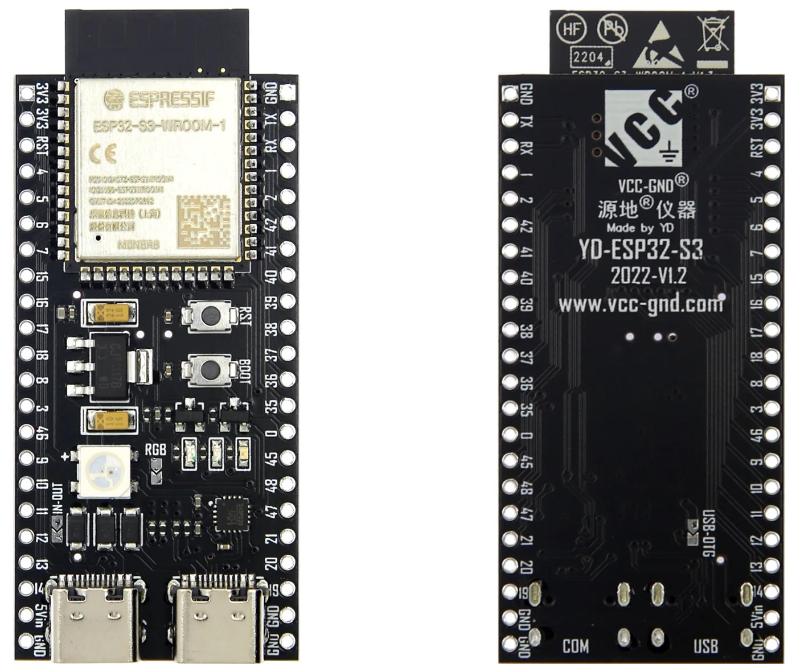
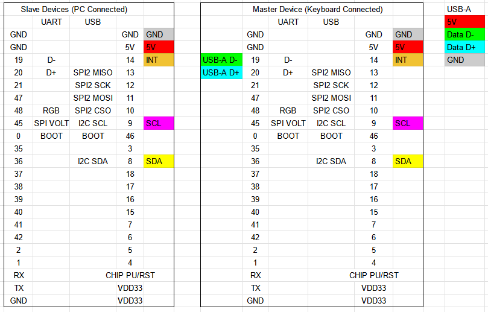
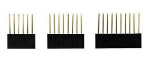
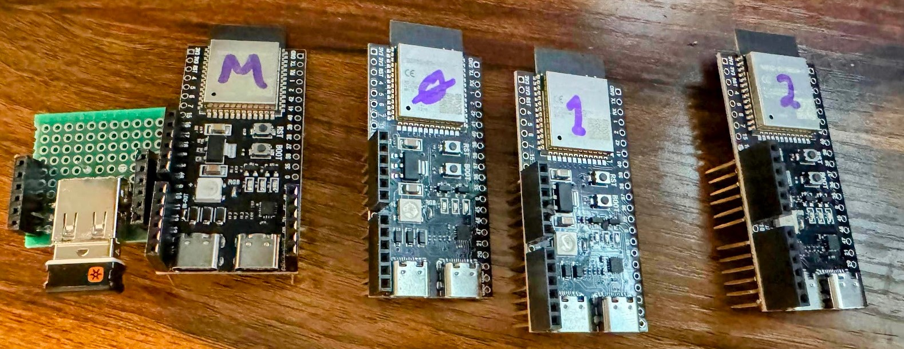
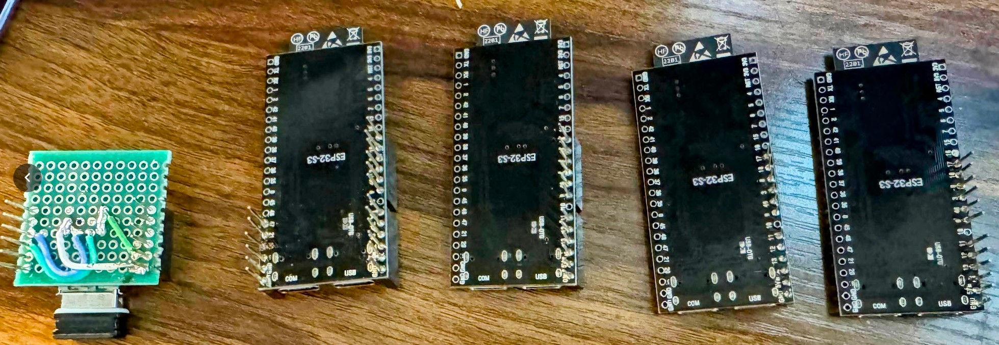
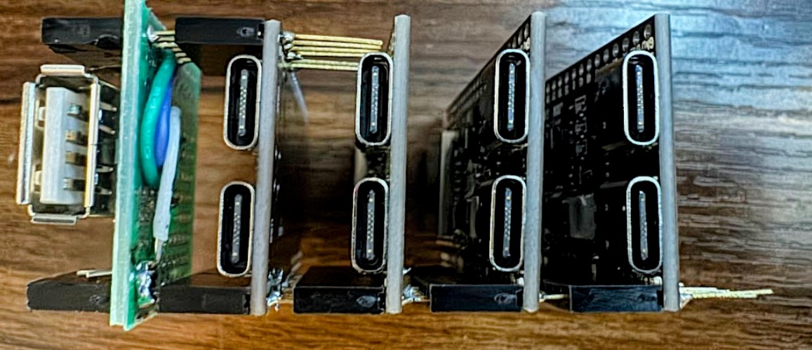
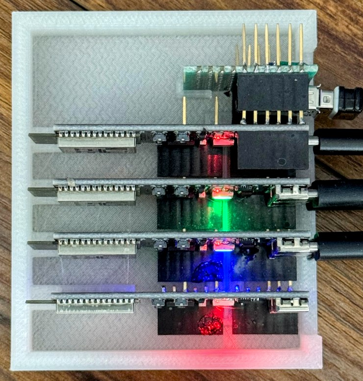

# hidswitch

Software to turn ESP32-S3 devices into a USB switch using the HID protocol.
This doesn't operate like a typical USB switch,
which essentially unplugs and re-plugs the devices when switching.
Instead, it runs an HID keyboard and mouse for each host device,
proxying the actual input from the connected USB device[s] to the selected host.

_CAVEAT_: I'm not a C programmer, this code is probably terrible.

## Required Hardware

You will need as many ESP32-S3 boards as you have devices to control (slaves), plus one for the master device.
It needs to be an S3 as that's the only board (as of this writing) with USB Host support.
Technically you could use heterogeneous boards, but these are cheap enough that I didn't bother.

I used the ESP32-S3-DevKitC that looks like this 
([Amazon Link](https://www.amazon.com/gp/product/B0B6HT7V7P/),
[Mfg Store Page](https://www.aliexpress.us/item/3256803838808294.html)):



I tracked down the [schematic](./docs/resources/YD-ESP32-S3-SCH-V1.4-1.pdf) and [layout](./docs/resources/ESP32-S3-inch.pdf).

You can identify this board by the 3 diodes just above the USB port and the placement of the buttons.
There are many different S3 prototyping boards, but this specific board has a few important features for this project:

### Backflow prevention diodes with bypass jumper

This allows us to share the 5V across all boards
(so only one PC needs to be powered on for it to work)
without back-feeding power from one PC to another.
For the master board we need to be able to power the connected USB peripheral, however,
and the `USB-OTG` diode bypass jumper allows us to do that.
(This last point is moot for my setup because I wired a USB-A port separately,
but if you were using the USB-C port directly it would be necessary).

### In/out bypass jumper for 5V

The 5V pin on some boards is output-only.
Given we want to be able to power master from any of the slaves when a PC is powered on,
we need to be able to feed power in via the 5V pin.
The `IN-OUT` jumper on this board allows that.

### Pins for USB D+ and D- 

I wanted support for USB-A devices without an adapter,
so pins for adding a port were helpful.

### Separate UART port

Allows us to have the boards connected to a programmer and test PCs at the same time.

## Wiring

### Pins

I wanted the boards to be stackable, so I configured the pins like this:



I use I2C so the SCL and SDA pins can be the same on every board.
The master is the only one using pins on the left side,
and then only if you're connecting a USB-A port.
All slaves are connected only on one side.

### Jumpers

I then soldered the `IN-OUT` jumpers on all boards.
You would also solder the `USB OTG` jumper on the back of the master if using USB-C for your keyboard/mouse.

### Headers

I soldered on stackable headers like these
([Amazon](https://www.amazon.com/dp/B077Z4KWM3)):



### USB-A

I wanted to use a Logitech wireless dongle as the primary device,
without needing an adapter.
So I additionally wired a USB-A socket to a board with appropriate pinouts.

### Result





### Stacking

Without the USB-A port they can be stacked in any order.
With a USB-A port the master needs to be on either end.



### Case

I printed a case for them to sit in ([STL](./docs/resources/KVMCase.stl)):



It assumes you have a USB-A board similarly sized to mine,
but if you're excluding USB-A it should still work.

## Building/Flashing

Because I'm using I2C, each slave needs its own address.
I could have rigged up some pin or something to decide them,
but instead I just compile firmware with the values hard-coded for each slave.

I use a Pi-Zero to flash my IoT devices.
It's much easier to deal with than windows constantly locking serial ports.

To use my build process you'll need a Linux machine with `esptools` installed to flash,
and a Linux machine with `docker` installed to build.
These can be the same machine.

I use a Pi-Zero to flash and WSL2 on my laptop to build.
You must be able to `ssh` from your build machine to the flash machine
(even if they are the same machine).

[`manage.sh`](./manage.sh) handles all the tasks for building, flashing and logging.

### `devices.txt` and Remote Serial port

`manage.sh` uses a plain text file named `devices.txt` in the root project folder to determine which firmware to flash to which device.
It will start a remote serial port on the flash device pointing to the serial port a given device is connected to.
See the top of the included [devices.txt](./devices.txt) for the structure of the file
and where to obtain the serial numbers.

To start the remote port, run `FLASH_HOST=<flash host> ./manage.sh <device> serial`, for example:

```bash
# Remote flash host
FLASH_HOST=192.168.1.86 ./manage.sh MSTR serial

# Local flash host
FLASH_HOST=localhost ./manage.sh MSTR serial
```

This command will persist and run the serial port for that device.

### Building/Flashing/Logging

Once the [serial port is open](#devicestxt-and-remote-serial-port),
you can now operate on the device:

```bash
# Build the firmware for SLV0:
FLASH_HOST=192.168.1.86 ./manage.sh SLV0 build

# Flash the firmware for SLV0:
FLASH_HOST=192.168.1.86 ./manage.sh SLV0 flash

# Run terminal monitor for SLV0:
FLASH_HOST=192.168.1.86 ./manage.sh SLV0 monitor

# Do all three steps:
FLASH_HOST=192.168.1.86 ./manage.sh SLV0 build flash monitor
```

## Usage

### LEDs

The slave devices have 4 led states:

* Cyan: Booted, but not yet received data from master
* Red: No host device detected
* Blue: Host device detected, not currently selected
* Green: Active host device

### Switching devices

There are two methods for switching devices:

#### Specific device

To choose a specific device, press <kbd>L Ctrl</kbd>+<kbd>R Ctrl</kbd>+<kbd>[number]</kbd>,
where `[number]` is 1-9 and represents `SLV0`-`SLV8`.

#### Next device

To switch to the next connected host device, press and hold <kbd>L Ctrl</kbd> and press <kbd>L Shift</kbd> twice.
This will skip any boards that don't detect a host device.
Or, if your mouse has six buttons, button six will switch devices as well.

### Shared input

When using a device,
mouse movements will be shared across inactive devices in a 20x20 pixel boundary.
This keeps all devices active while you're actively using one of them.

## Hub Support

Hub support is inherited from
[upstream](https://github.com/espressif/esp-idf/blob/ce6085349f8d5a95fc857e28e2d73d73dd3629b5/components/usb/CMakeLists.txt#L32).
Worth nothing that the ESP32S3 is
[limited to 8 USB channels](https://github.com/espressif/esp-idf/issues/14818#issuecomment-2453460404).
Some HID devices implement both KB and mouse, and hub devices also count.
